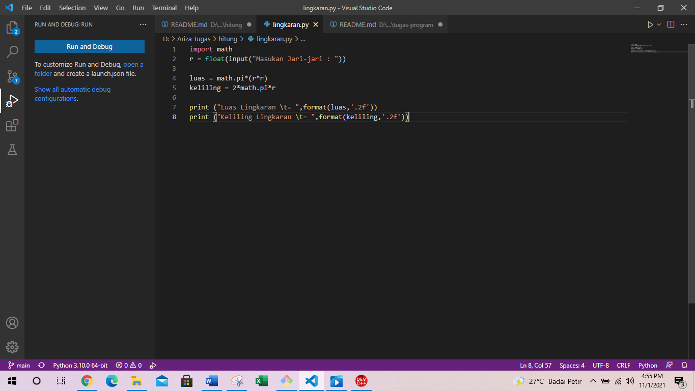
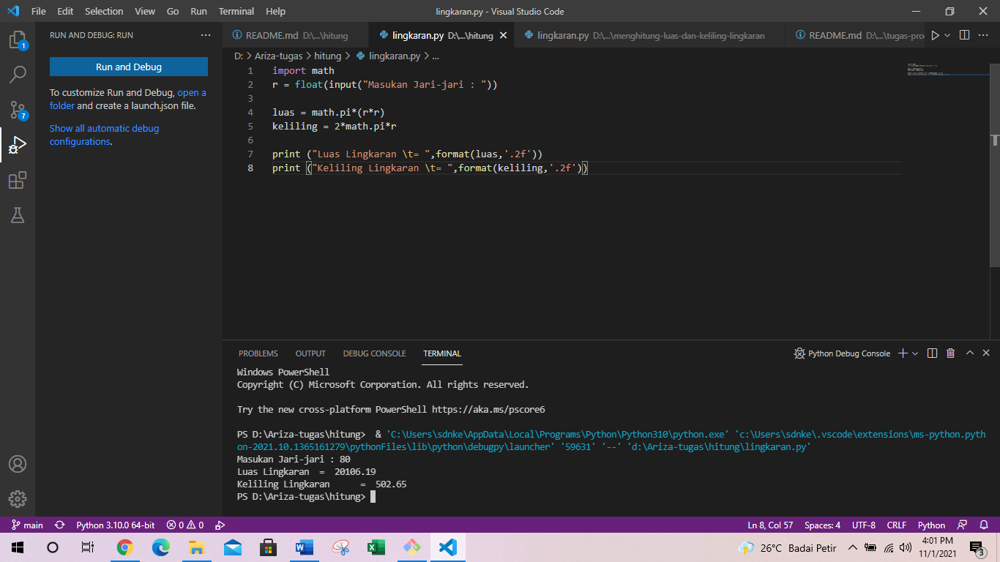

# hitung
## Program menghitung luas dan keliling lingkaran dengan python
### Berikut flowchart dan program nya 
Kita akan menggunakan visual studi code untuk editor nya
Rumus Luas & Keliling Lingkaran

    
    Luas     = π × r²
    Keliling = 2 x π × r
    
    Nilai Phi yang akan kita gunakan adalah 3.14
    rmerupakan jari-jari lingkaran

Phi merupakan nilai konstanta di matematika sementara jari-jari merupakan jarak antara titik pusat dengan tepi lingkaran. Sebetulnya ada rumus lain untuk menghitung keliling lingkaran yaitu dengan menggunakan diameter, tapi pada kasus ini kita cukup menggunakan jari jari lingkaran saja.

berikut ini program nya:

berikut script nya:

    import math
    r  = float(input("Masukan Jari-jari : "))

    luas = math.pi*(r*r)
    keliling = 2*math.pi*r

    print ("Luas Lingkaran \t= ",format(luas,'.2f'))
    print ("Keliling Lingkaran \t= ",format(keliling,'.2f'))
Berikut untuk output nya:

Beginilah output nya:

    Luas Lingkaran          =  20106.19
    Keliling Lingkaran      =  502.65
berikut flowchart nya:

berikut adalah program nya terimakasih bila ada kekurangan mohon maaf wassalamuallaikum wr wb.

